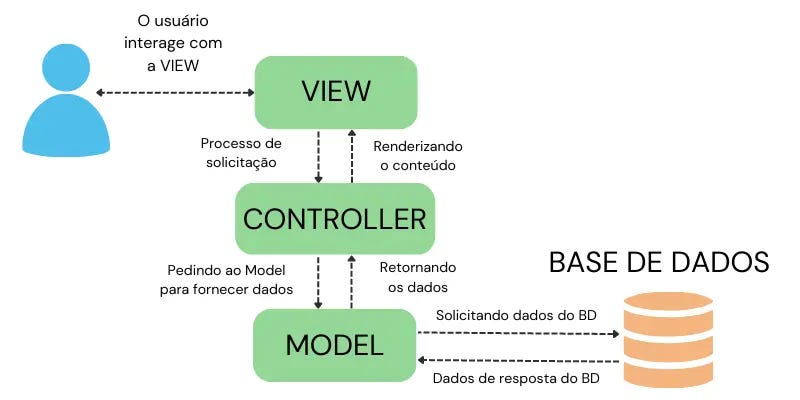

# Projeto de Dados Educacionais

Este é um projeto web interativo que facilita o acesso e a visualização de dados educacionais do [INEP](https://www.gov.br/inep/pt-br/acesso-a-informacao/dados-abertos/indicadores-educacionais/taxas-de-rendimento-escolar). A plataforma oferece gráficos, mapas e insights para ajudar pesquisadores, gestores e outros profissionais a tomarem decisões estratégicas baseadas em dados.

## Funcionalidades

-**Visualização Interativa**: Gráficos e mapas que tornam os dados complexos mais compreensíveis.

-**Análise Detalhada**: Explore indicadores educacionais por região, estado ou município.

-**Tendências e Insights**: Identifique padrões importantes para o planejamento estratégico.

-**Fale Conosco**: Formulário para contato direto com a equipe.

## Tecnologias Utilizadas

-**HTML5** e **CSS3**: Estrutura e estilização da aplicação.

-**Tailwind CSS**: Framework CSS para estilização rápida e responsiva.

-**Python (Flask)**: Backend para servir as páginas e gerenciar rotas.

-**Google Fonts**: Fonte personalizada para uma melhor experiência visual.

## Estrutura do Projeto

.
**├── venv/                           # Ambiente virtual Python
│   ├── Include/
│   ├── Lib/
│   ├── Scripts/
│   ├── pycache/               # Arquivos compilados Python
│   └── pyvenv.cfg                 # Configuração do ambiente virtual
├── static/                         # Arquivos estáticos
│   ├── JS/
│   │   └── script.js              # JavaScript customizado
│   └── style.css                  # Estilos CSS
├── templates/                      # Templates HTML
│   ├── dashboard.html             # Página de dashboard
│   └── index.html                 # Página inicial
├── file/                           # Diretório de arquivos de dados
│   └── tx_rend_brasil_regioes_ufs_2024.xlsx  # Dados em Excel
├── app.py                          # Aplicação principal Flask
├── data_loader.py                  # Carregamento e processamento de dados
├── statistics_calculator.py        # Cálculos estatísticos
├── visualization_generator.py      # Geração de visualizações
├── requirements.txt                # Dependências do projeto
├── README.MD                       # Documentação do projeto
└── .gitignore                      # Arquivos ignorados pelo Git (implícito)**


## Arquitetura e Evolução do Projeto

### Fase Atual: Processamento de Arquivos XLSX

Atualmente, o projeto opera com dados estáticos através do arquivo `tx_rend_brasil_regioes_ufs_2024.xlsx`. A estrutura implementada inclui:

* **data_loader.py** : Responsável pela leitura e pré-processamento dos dados do Excel
* **statistics_calculator.py** : Realiza cálculos estatísticos sobre os dados carregados
* **visualization_generator.py** : Gera visualizações gráficas a partir dos dados processados

## Fluxo de Dados e Comunicação

O projeto segue uma arquitetura MVC (Model-View-Controller) simplificada, onde:

1. **Model (Dados)** : Arquivos Python que processam os dados (`data_loader.py`, `statistics_calculator.py,visualization_generator.py`)
2. **View (Visualização)** : Templates HTML com Jinja2 e arquivos estáticos (JS/CSS)
3. **Controller (Lógica)** : Aplicação Flask (`app.py`) que coordena tudo

  

### app.py

O arquivo `app.py` é o coração da aplicação, responsável por:

* Configurar e inicializar a aplicação Flask
* Definir as rotas e endpoints
* Coordenar a comunicação entre todos os componentes

### data_loader.py - Processamento de Dados

Responsável pela extração e limpeza dos dados:

* Lê o arquivo Excel usando pandas
* Padroniza nomes de colunas
* Realiza conversões de tipos de dados
* Trata valores missing


### statistics_calculator.py - Análise Estatística

Realiza cálculos e gera insights:

* Estatísticas descritivas (média, mediana, desvio padrão)
* Análises comparativas por região e dependência administrativa
* Geração de insights automáticos

### Templates HTML com Jinja2 - Sistema de Visualização

Os templates usam a sintaxe Jinja2 para renderizar dados dinâmicos

## Bibliotecas e frameworks 

## Backend (Python)

### Flask (v2.3.3)

 **Propósito** : Framework web principal para criar a aplicação e gerenciar rotas
 **Uso no projeto** :

* Criação do servidor web e definição de endpoints
* Renderização de templates HTML com Jinja2
* Gerenciamento de requisições e respostas
* Integração entre todos os componentes do sistema

### Pandas (v1.5.3)

 **Propósito** : Manipulação e análise de dados
 **Uso no projeto** :

* Leitura do arquivo Excel com `pd.read_excel()`
* Criação de dataframes `df()`
* Limpeza e transformação dos dados educacionais
* Cálculos estatísticos básicos (médias, medianas, etc.)
* Filtragem e agrupamento de dados por região e características

### Openpyxl (v3.1.2)

 **Propósito** : Leitura/escrita de arquivos Excel (complementar ao pandas)
 **Uso no projeto** :

* Processamento específico de planilhas Excel
* Manipulação de células e formatação de arquivos .xlsx

### NumPy (v1.24.3)

 **Propósito** : Operações matemáticas
 **Uso no projeto** :

* Cálculos estatísticos avançados
* Operações matriciais para melhor performance
* Geração de sequências numéricas para análises

### Matplotlib (v3.7.1)

 **Propósito** : Geração de gráficos e visualizações
 **Uso no projeto** :

* Criação de gráficos estáticos para o dashboard
* Visualização de distribuições e tendências
* Exportação de gráficos em formato de imagem

### Seaborn (v0.12.2)

 **Propósito** : Visualização estatística avançada
 **Uso no projeto** :

* Gráficos mais elaborados e estilizados
* Visualização de relações entre variáveis
* Heatmaps e visualizações multivariadas

## Frontend

### Tailwind CSS (v3.3.0)

 **Propósito** : Framework CSS para design responsivo
 **Uso no projeto** :

* Estilização rápida e consistente da interface
* Design responsivo para diferentes dispositivos
* Componentes pré-estilizados para formulários e cards

### Chart.js (v4.3.0)

 **Propósito** : Criação de gráficos interativos no navegador
 **Uso no projeto** :

* Visualizações interativas de dados educacionais
* Gráficos dinâmicos que respondem a interações do usuário
* Animações e transições suaves

### Google Fonts

 **Propósito** : Tipografia personalizada
 **Uso no projeto** :

* Importação da fonte "Inter" para melhor legibilidade
* Consistência visual e profissionalismo no design

## Próximas Etapas: Integração com API e Banco de Dados

O projeto está planejado para evoluir para uma arquitetura mais robusta:

### 1. **Integração com API do INEP**

* Implementação de clientes HTTP para consumo de dados em tempo real
* Sistema de cache para otimizar requisições à API
* Tratamento de erros e fallback para dados locais

### 2. **Migração para Banco de Dados**

* Modelagem de schema para dados educacionais
* Implementação de ORM (SQLAlchemy ou similar)
* Sistema de ETL (Extract, Transform, Load) para popular o banco
* Consultas otimizadas para análises complexas

### 3. **Vantagens da Evolução**

* **Dados em Tempo Real** : Atualizações automáticas via API
* **Escalabilidade** : Melhor performance com grandes volumes de dados
* **Persistência** : Histórico de dados para análise temporal
* **Confiabilidade** : Melhor tratamento de erros e consistência de dados

## Como Executar o Projeto

1. **Clone o repositório**
   **bash**

   ```
   git clone [url-do-repositório]
   cd [nome-do-projeto]
   ```
2. **Configure o ambiente virtual**
   **bash**

   ```
   python -m venv venv
   source venv/bin/activate  # Linux/Mac
   # ou
   venv\Scripts\activate     # Windows
   ```
3. **Instale as dependências**
   **bash**

   ```
   pip install -r requirements.txt
   ```
4. **Execute a aplicação**
   **bash**

   ```
   python app.py
   ```
5. **Acesse no navegador**
   **text**

   ```
   http://localhost:5000
   ```
